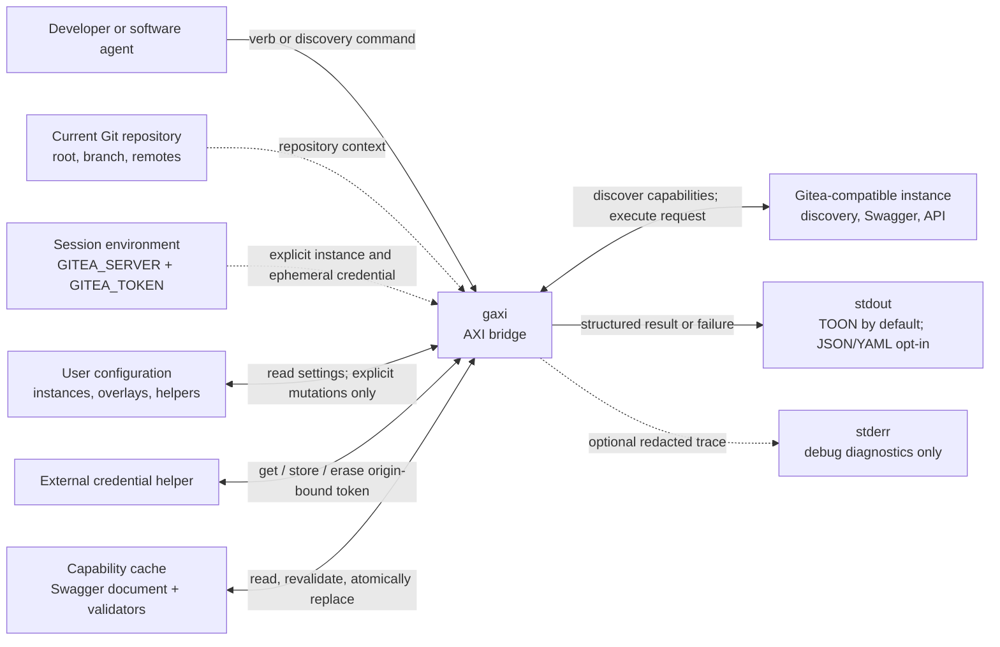
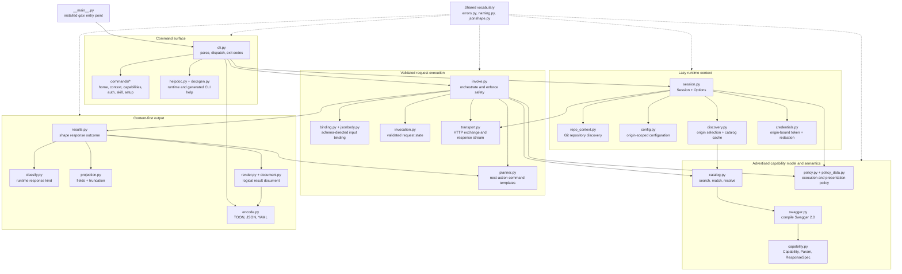
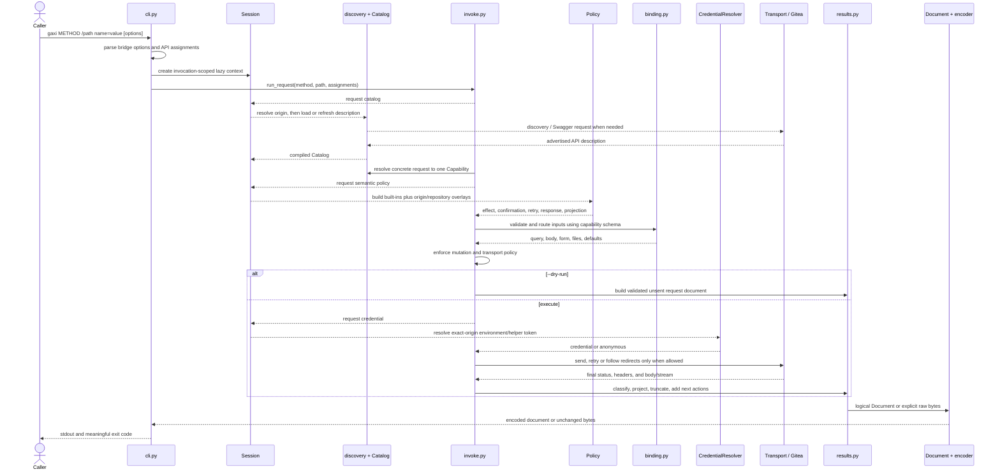
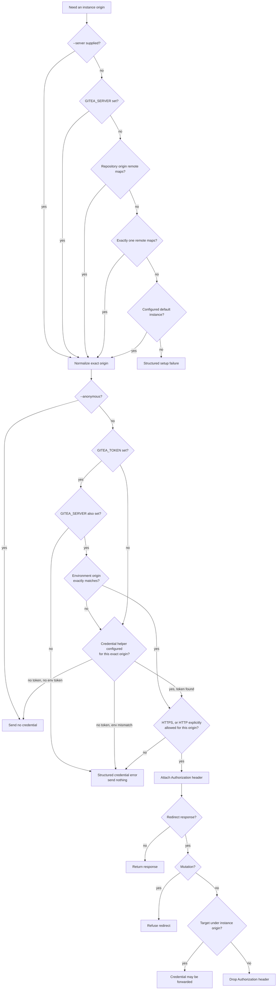
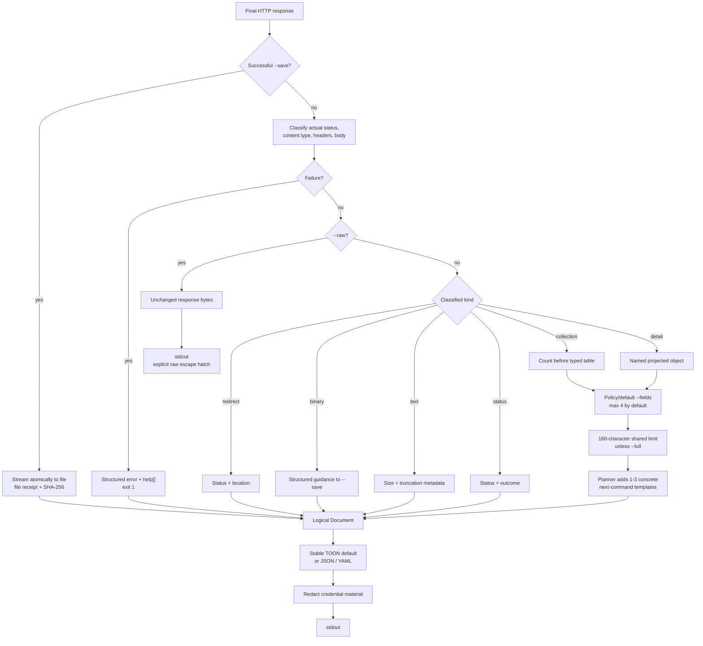

# Architecture map

This is a navigational map of `gaxi` for developers and architects. It is not a
second specification: use the [domain glossary](../CONTEXT.md), the
[clean-sheet design](design/gitea-axi-bridge-clean-sheet.md), and the
[architecture decisions](adr/) for normative language and rationale.

## System context

`gaxi` is an AXI bridge between a concrete caller request and one capability
advertised by a Gitea-compatible instance. It combines instance facts with local
semantic policy, but does not hide either source behind a generated API client.

The instance origin is a trust boundary. Credentials, configuration, cached
descriptions, and overlays are all bound to an exact normalized origin.

## Code map

The package is organized as a pipeline with `Session` as the lazy composition
root. Arrows show the main call or data-flow direction, not every import.

The important ownership boundaries are:

- `cli.py` owns command grammar and process behavior, not API semantics.
- `Session` owns lazy context and dependency reuse for one invocation.
- `Catalog` owns what the instance advertises; `Policy` owns what those
  capabilities mean for safe execution and compact presentation.
- `invoke.py` decides whether and how a request may be sent; `results.py`
  decides what the returned response becomes.
- `Document` is the shared logical output model. Encoders do not rediscover
  response semantics.

## Request lifecycle

The main verb path resolves and validates everything before sending a mutation.
Dashed portions are lazy and may be satisfied from memory or cache.

Special commands (`home`, `context`, `capabilities`, `auth`, `skill`, and
`setup`) branch in `cli.dispatch`; they reuse the same `Session`, `Document`, and
encoding infrastructure where applicable.

## Origin and credential safety

Origin discovery and credential discovery are deliberately separate. Repository
context may select an instance, but it can never scope a bare `GITEA_TOKEN`.

## AXI result shaping

Response handling is content-first. There is no universal HTTP envelope; each
outcome receives the smallest shape that remains definitive and actionable.

Runtime classification uses the actual response first and consults the
advertised response schema only when metadata is absent. Projection preserves
the instance's field names; policy selects fields but does not rename them.

## Where to change behavior

| Change | Start here | Usually verify alongside |
|---|---|---|
| Command or option grammar | `src/gaxi/cli.py`, `src/gaxi/helpdoc.py` | `src/gaxi/docsgen.py`, CLI tests |
| Instance discovery or cache | `src/gaxi/discovery.py` | `src/gaxi/repo_context.py`, discovery tests |
| Capability matching | `src/gaxi/catalog.py`, `src/gaxi/capability.py` | `src/gaxi/swagger.py`, catalog tests |
| API input behavior | `src/gaxi/binding.py` | `src/gaxi/jsonbody.py`, binding tests |
| Mutation/retry semantics | `src/gaxi/policy.py`, `src/gaxi/policy_data.py` | `src/gaxi/invoke.py`, policy tests |
| Response schema or truncation | `src/gaxi/results.py`, `src/gaxi/projection.py` | `src/gaxi/render.py`, result/contract tests |
| TOON/JSON/YAML syntax | `src/gaxi/document.py`, `src/gaxi/encode.py` | encoder/document tests |
| Authentication | `src/gaxi/credentials.py`, `src/gaxi/commands/auth.py` | config and credential tests |
| Agent context generation | `src/gaxi/commands/context.py`, `skill.py`, `setup.py` | command and setup tests |

Run `uv run invoke verify` after changes. CLI documentation is generated from
the runtime help model with `uv run invoke docs`.
